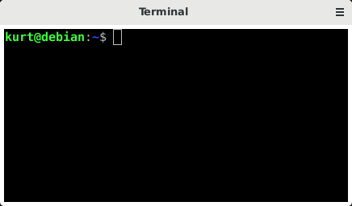

# Terminal

This widget provides an embedded terminal for running tests etc.
within the same python interpretor as hazzy.

## Dependencies

In addition to the main hazzy dependencies, the terminal widget requires

  * vte 2.91 or later

## Installing dependencies

### Debian Stretch

`$ sudo apt-get install gir1.2-vte-2.91`
