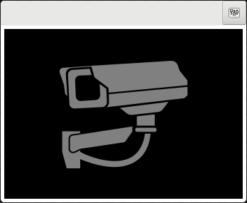

# Video

This widget provides a video viewer and http streamer.
The stream can be viewed by pointing your web browser to http://127.0.0.1:1337/

## Dependencies

In addition to the main hazzy dependencies, the video widget requires

  * gstreamer1.0-plugins-bad 1.10.4 or later

## Installing dependencies

### Debian Stretch

`$ sudo apt-get install gstreamer1.0-plugins-bad`
